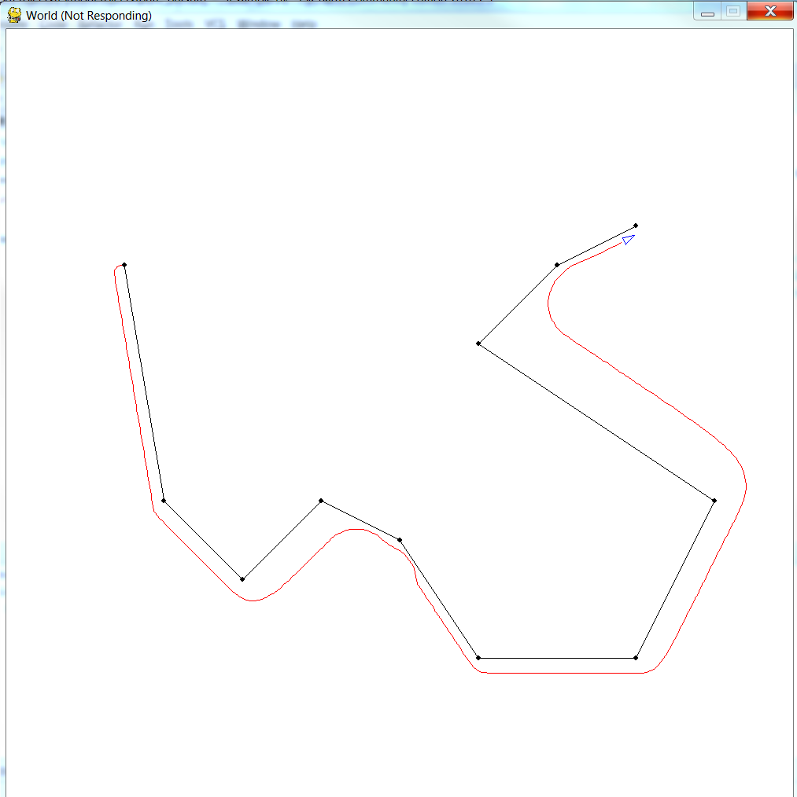

# Simple implementation of pure pursuit controller
- Pure pursuit controller is based on fitting a semi-circle through the vehicle’s current configuration to a point on the reference path ahead of the vehicle by a distance L called the lookahead distance.

# Gui
- 
